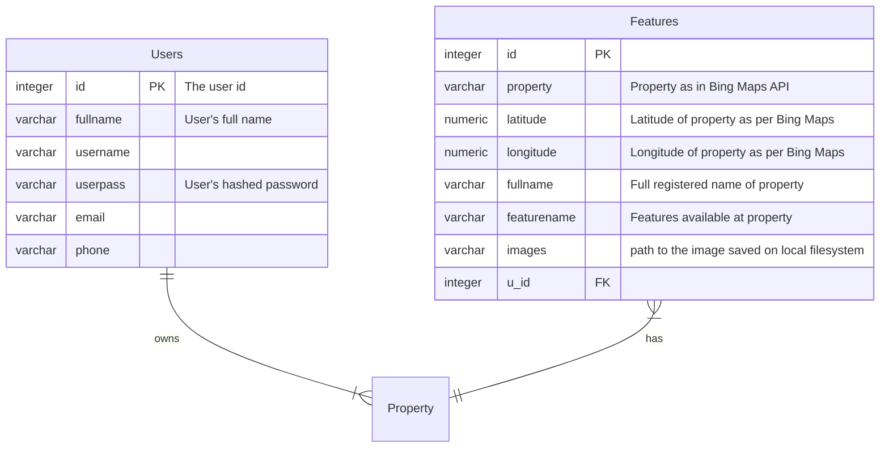

# FoTc
Friends of the Community - A web-portal to lookup accessible locations

#### Video Demo: [watch here on YouTube](https://youtu.be/0eyZIVjKnn8)
#### Research paper: [Read here on IRJMETS website](https://www.irjmets.com/paperdetail.php?paperId=ad8ff81be5bdbbe0f7611f4b8bba1855&title=Web+assistance+for+physically+disabled+people&authpr=Abhishek+Rawat)
#### Description:
This project is a Flask app which displays the accessiblity features of physical locations on Earth and an assosciated smart Bing Map integrated using JavaScript. We aim to develop a centralized web-based portal for storing and sharing of information about accessible buildings, public places, offices. The system will also store their physical locations so that the information can also be shown on a on-screen map. The system will store and share information about the accessibility features viz. provisions of ramps, handrails, accessible toilets, Braille signage, accessible counters, lifts, wheelchairs etc. The system will store and share photographs and videos of such places. Registration of accessible buildings or locations by the owners (private & government both). Display of information to the disabled persons as per search criteria on a map based platform.

## Database Schema

## Layout
- Register
- Log In
    - Upload Features
- Update
- Navigate
    - Check Accessibility
    - Get Directions
    - Search Location
- Contact Us

#### Register
This is a registration page where one can easily sign up for a new account. This will redirect to update personal details page.
#### Log In
You can log into your account here. On successful log in, you will be redirected to the personal dashboard. This is also our first page. After that if you are a property owner then you can upload the features of location to our website.
#### Update
This menu links to all pages for updating personal details of the user and it only update that changes in profile which user wish to update. However, the data is finally stored.
###### Update Personal Details
Here, the user can update you user name, contact number, email. This page redirects the user to the index page or the personal dashboard. Your new information will be stored instantly in database.
###### Remove Existing Account
Here, one can delete his account if necessary. All data associated with the user is discarded from the database upon the deletion. This page, in particular, asks for a confirmation before deleting, thus preventing accidental changes and data loss.
#### Navigation
This navigation bar menu links the user to following pages.
###### Get Directions
Here you can search your desired location by typing location name in destination barand current location in first search bar. This page shows up on successful log in. It is the index page of our project.
###### Check Accessibility
This page provides you the information about the accessibility features of your desired destination's location. After search you will be provided accesibility features of that place with images and their name and at bottom your name, email id and contact number will also be displayed.
###### Search Location
This website search your desired location through bing maps. we have accessed the API key of bing maps and use it for our searching process. After getting the desired location you can choose either you can see it normal map format or you can also watch directions and all other places in satellite view also.You can search your desired location by just speech recognition, for that you just have to click on mic button.

## Security and Data Privacy
The session data is stored on the top of cookies and signed by the server cryptographically. Flask has been used to track the session data. The user's password is secured using Werkzeug. Session data is cleared on logging out successfully or once the server is turned off. Any data you entered for storage is completely private and visible only to you when logged in. No data is shared with or sold to any third-party.

## Technologies used
- HTML
- CSS
- JavaScript
- PostgreSQL via psycopg2
- Flask
- BootStrap
- Bing Maps API & SDK (AJAX)
- Speech Recognition via gTTS API

## Developers
- [Abhishek Rawat](https://github.com/abhishek1524)
- [Aieshah Nasir](https://github.com/aie007)
- [Akshat Singh Gour](https://github.com/akshat123007)
- [Akshat Singh Rathore](https://github.com/AkshatSR2003)
